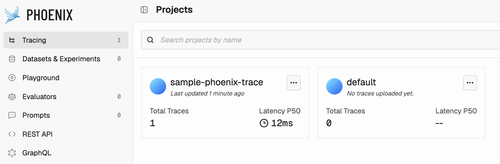
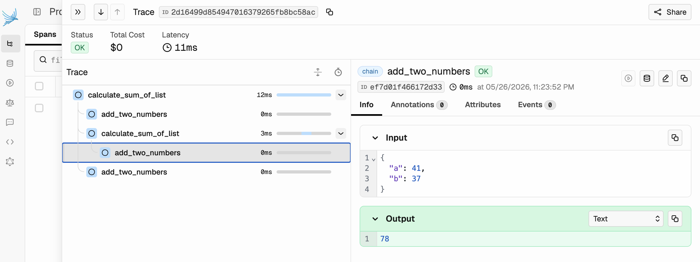
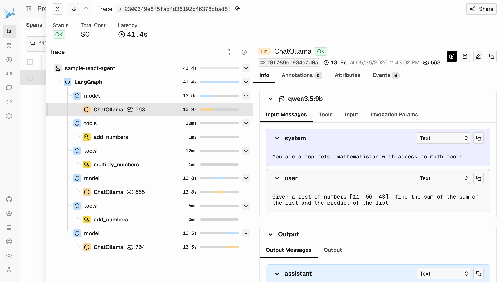

# Phoenix Examples
## Start Phoenix Server
`phoenix serve` should start a server on `http://localhost:6006`

## Trace a basic function
Run `python sample_phoenix_trace.py`, you will see something like below in the terminal
```bash
🔭 OpenTelemetry Tracing Details 🔭
|  Phoenix Project: sample-phoenix-trace
|  Span Processor: SimpleSpanProcessor
|  Collector Endpoint: http://localhost:6006/v1/traces
|  Transport: HTTP + protobuf
|  Transport Headers: {}
|  
|  Using a default SpanProcessor. `add_span_processor` will overwrite this default.
|  
|  ⚠️ WARNING: It is strongly advised to use a BatchSpanProcessor in production environments.
|  
|  `register` has set this TracerProvider as the global OpenTelemetry default.
|  To disable this behavior, call `register` with `set_global_tracer_provider=False`.
```

This is just an indication that tracing in fact did get used. Once we go to Phoenix UI, we can see the project `sample-phoenix-trace` as well.



And once we go into the project and check the generated trace, individual functions with their inputs and outputs are logged.



## Trace and Agent with Tool Calls
Run `python langgraph_react_agent/react_agent.py` from the repository root. A new project `sample-agent-trace` gets created in phoenix, and we can see the trace of our react agent with tool calls.


